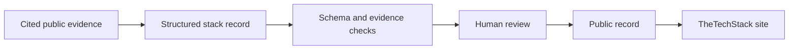

# TheTechStack — Public Stack Records

Structured, evidence-backed records of what companies actually run. This data powers
[thetechstack.com/stacks](https://www.thetechstack.com/stacks).

Every tool entry carries a status (`current` / `previous` / `evaluating`), a confidence
label (`confirmed` / `inferred` / `reported`), and cited evidence with source URLs.

## How the system works



The private research and editorial system remains private. This repository exposes the
public contract: records, evidence, confidence labels, validation rules, and correction
history.

## Corrections welcome — especially from the companies themselves

Work at one of these companies and see something wrong or stale? **Open a pull request.**
That's the whole point of this repo. If editing JSON is inconvenient, open a
[stack correction issue](https://github.com/KyleBrierley/thetechstack-data/issues/new?template=stack-correction.yml)
instead. See [CONTRIBUTING.md](CONTRIBUTING.md) for the evidence and review rules.

Records verified by the company get a ✓ badge on the site.

> Publication status: corrections are reviewed here, but the automated public-to-site
> deployment path is still being completed. An accepted correction will not be treated
> as live until a maintainer confirms the site update.

## Schema

Records conform to [`schema/stack-record.schema.json`](schema/stack-record.schema.json),
categories to [`schema/categories.md`](schema/categories.md).

Run the same validation used in pull requests:

```bash
npm install
npm run validate
```

## What this demonstrates

- Evidence-backed structured research with explicit provenance.
- Honest `confirmed`, `inferred`, and `reported` confidence labels.
- Current, previous, and evaluating states instead of destructive history edits.
- Automated contract checks paired with human editorial and verification gates.
- A public correction surface that does not expose private product or orchestration code.

## License

Data and schema: [CC BY 4.0](LICENSE) — use them with attribution to TheTechStack.

The records and schema in this repository are the intended public source of truth. The
current site synchronization direction is being migrated so approved public corrections
cannot be overwritten by the private publishing system.
